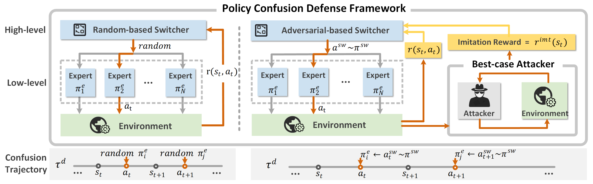

# Policy-Confusion-Defense
This is the code for "Towards Preventing Imitation Learning Attack via Policy Confusion Defense"

## Abstract
In real-world reinforcement learning (RL) applications, privacy protection for commercially valuable policies has been highlighted due to their vulnerability to imitation learning (IL) attacks, where attackers can approximate near-optimal policies only from their observations.
Existing defense methods, including generating adversarial trajectories and training privacy-preserving RL policies, suffer from limitations such as scenario specificity and limited effectiveness.
To tackle the limitations, we model the privacy-preserving policy training as the problem of finding an optimal dynamical switching among a diverse set of expert policies, aiming to induce the confusion for potential imitation attackers. Thus, we propose a hierarchical Policy Confusion Defense (PCD) framework that incorporates multiple near-optimal expert policies at the low level and employs a switcher policy at the high level. 
Furthermore, to accommodate various scenarios, two high-level switcher policies are developed: a random-based switcher with low resource requirements, and an adversarial-based switcher optimizing the low-level policy selection with dual objectives on task-capability and defense-effectiveness.
Extensive experiments are conducted to evaluate our defense framework against three imitation attacks, compared to two state-of-the-art defense methods. The results demonstrate that our framework is effective in (a) degrading the approximated policies by imitation attackers while (b) maintaining good performance in the original RL tasks.




### Getting Started

Before proceeding, make sure you have [Mujoco](https://github.com/google-deepmind/mujoco) installed by following the official installation guide.  

#### Installation  

Clone the repository:  
```bash
git clone git@github.com:li-yike/Policy-Confusion-Defense.git
```  

Create and activate the conda environment:  
```bash
conda env create -f environment.yml
conda activate confusion_defense
```  

#### Execution  

The **Policy Confusion Defense (PCD)** framework adopts a hierarchical structure. At the lower level, it maintains multiple near-optimal expert policies; at the higher level, it employs a switcher policy.  
We provide two types of high-level switchers:  
1. **Random-based switcher (R-PCD):** introduces stochasticity to generate confusion with minimal computational overhead.  
2. **Adversarial-based switcher (A-PCD):** leverages adversarial training, incorporating environment dynamics and attacker behaviors.  

##### Running the Random-based Policy Confusion Defense (R-PCD)  

1. **Train expert policies:**  
```bash
python3 agent-train.py --algo trpo --task Hopper-v3 --seed 100 -n 2000000
```  

2. **Generate confusion trajectories** (example with four low-level expert policies):  
```bash
python3 mixture-agent.py "/root/your_agent/trpo_Hopper_1" "/root/your_agent/trpo_Hopper_2" "/root/your_agent/trpo_Hopper_3" "/root/your_agent/trpo_Hopper_4" --task Hopper-v3 --mixture 3 --interval 20 --trajs_num 100 --savepath "/root/confusion_trajs" --max_trajs_len 1000 --deterministic True
```  

3. **(Attacker) Perform imitation learning on confusion trajectories:**  
   - **Behavior Cloning (BC)-based attacker:**  
   ```bash
   python BC/run_clone.py --expert_data "/root/your_result/trpo_Hopper_step-interval=20-model-num=4-mixture.h5" --env_name Hopper-v3 --trajs_num 100 --limit_trajs 1000 --savepath "/root/your_result/BC_learned/" --epoch 30
   ```  

   - **IRL-based attacker:**  
     - Step 1: Train reward model  
     ```bash
     python IRL/firl/irl_samples.py config/sample/agents/hopper.yml ppo
     ```  
     - Step 2: Train an optimal policy model  
     ```bash
     python IRL/commom/train_optimal.py config/sample/experts/hopper.yml
     ```  

   - **GAIL-based attacker:**  
   ```bash
   python GAIL/imitate_mj.py --mode ga --env_name Ant-v3 --data /root/your_result/trpo_Hopper_step-interval=20-model-num=4-mixture.h5 --limit_trajs 1000 --data_subsamp_freq 20 --favor_zero_expert_reward 0 --min_total_sa 10000 --max_iter 501 --reward_include_time 0 --reward_lr .01
   ```  

##### Running the Adversarial-based Policy Confusion Defense (A-PCD)  

1. **Train expert policies** (same as in R-PCD).  
2. **Train the switcher policy:**  
```bash
python3 Adv_Defender/main.py
```  
3. **Generate confusion trajectories:**  
```bash
python3 Adv_Defender/agent-load.py
```  
4. **(Attacker) Perform imitation learning on confusion trajectories** (same as in R-PCD).  
